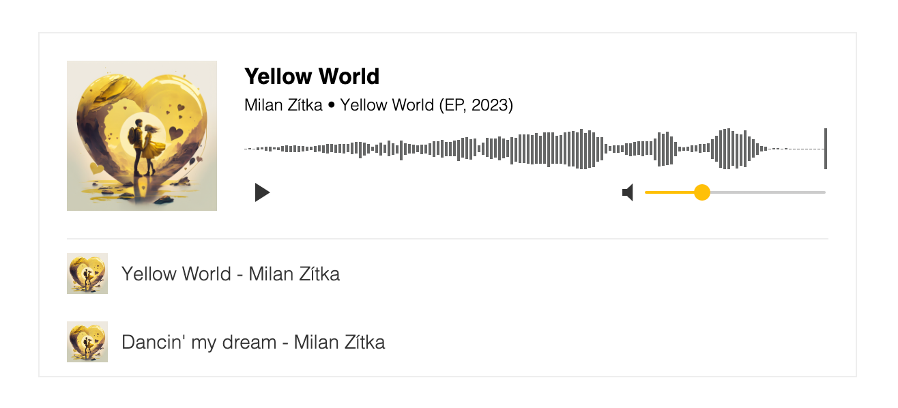

# lw-audio-player

Audio player web component with optional playlist/album view

## Screenshot


## Docs
[audio-player.littlewall.dev](https://audio-player.littlewall.dev)

## Quick start

```html
<script src="https://cdn.jsdelivr.net/npm/@lwdev/audio-player@latest" type="module"></script>

<lw-audio-player>
    <lw-audio-player-song
        artist="Milan Zítka"
        album="Yellow World (EP, 2023)"
        cover="/images/yellow-world.jpg"
        url="/audio/milan-zitka_yellow_world.mp3"
        title="Yellow World"
    ></lw-audio-player-song>
</lw-audio-player>
```

## License

MIT License.
